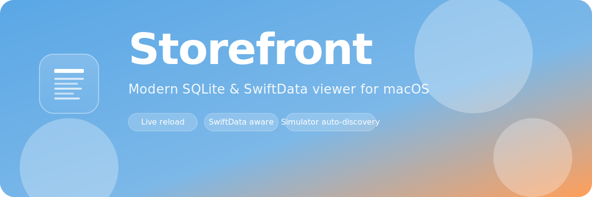

<p align="center">
  
</p>

<p align="center">
  <a href="https://github.com/jun7680/Storefront/releases/latest">
    
  </a>
  <a href="https://github.com/jun7680/Storefront/actions/workflows/build.yml">
    
  </a>
  <a href="./LICENSE">
    
  </a>
  
  
  <a href="https://github.com/jun7680/Storefront/stargazers">
    
  </a>
</p>

<p align="center">
  <strong>Modern SQLite &amp; SwiftData viewer for macOS.</strong><br>
  <em>Native SwiftUI · Live reload · Built for iOS developers</em>
</p>

<p align="center">
  🚧 <em>Pre-alpha — v0.1.0 is under active development.</em>
</p>

---

## ✨ Features

<table>
<tr>
<td width="50%" valign="top">

**📂 Open any SQLite store**
Drag & drop or ⌘O for `.sqlite`, `.db`, `.store` files.

**🗂 Browse tables and rows**
3-column split view — sortable, resizable, dynamic.

**🔄 Live reload**
Auto-refresh on file change, fully WAL-aware.

**🔒 Read-only by design**
Your databases are never written to.

</td>
<td width="50%" valign="top">

**📱 Simulator auto-discovery**
One click to open any installed iOS simulator app's DB.

**🍂 SwiftData native**
Automatic `Z_` prefix normalization + metadata awareness.

**🎨 Native macOS feel**
Sky Blue × Sunset Orange palette, dark mode first-class.

**⚡ Built in SwiftUI + TCA**
Modern reactive stack — snappy, testable, observable.

</td>
</tr>
</table>

## Requirements

| | Version | Needed for |
|---|---|---|
| **macOS** | 26 Tahoe or later | Running the app |
| **Xcode** | 26 or later | Building from source (B, C) |
| **Homebrew** | latest | Installing `xcodegen`, `create-dmg` (B, C) |
| **GitHub CLI** (`gh`) | optional | Auto-star after `make install` (C) |

---

## Install

Three paths depending on who you are. End users go with **A**. Developers who want to build from source pick **B** (Xcode GUI) or **C** (command line).

### Prerequisites — one-time tool setup

> Skip this block if you only plan to use path **A**.

**1. Install Homebrew** (macOS package manager):

```bash
/bin/bash -c "$(curl -fsSL https://raw.githubusercontent.com/Homebrew/install/HEAD/install.sh)"
```

**2. Install Xcode 26+** — from the [Mac App Store](https://apps.apple.com/us/app/xcode/id497799835) or [Apple Developer portal](https://developer.apple.com/download/applications/). After installing, register the command-line tools:

```bash
sudo xcode-select -s /Applications/Xcode.app
xcodebuild -license accept   # accept the SDK license
```

**3. Install build helpers**:

```bash
brew install xcodegen create-dmg
```

**4. (Optional) Install GitHub CLI** — enables the one-click star prompt at the end of `make install` / `make dmg`:

```bash
brew install gh
gh auth login
```

---

### A. Download the DMG (end users) ⭐ Recommended

1. Grab `Storefront-*.dmg` from the [Releases page](https://github.com/jun7680/Storefront/releases)
2. Double-click the DMG → drag `Storefront.app` into `Applications`
3. **First launch — bypass Gatekeeper** (pick whichever is easiest):

   **Option 1: Finder (simplest)**
   - In `Applications`, **right-click `Storefront.app` → Open → Open**
   - On macOS 15+ you may also see a button under **System Settings › Privacy & Security › "Open Anyway"** — click it once.

   **Option 2: One-liner in Terminal**
   ```bash
   xattr -cr /Applications/Storefront.app
   ```
   Afterwards the app opens on regular double-click forever.

   **Option 3: Strip the quarantine attribute from the DMG before mounting**
   ```bash
   xattr -d com.apple.quarantine ~/Downloads/Storefront-*.dmg
   ```

> **Why the warning?** Storefront ships without Apple notarization because it is a pure open-source side project — no Apple Developer Program ($99/year) is involved. The source on [GitHub](https://github.com/jun7680/Storefront) is exactly what you run.

### B. Clone & run in Xcode (fastest for developers)

Requires the prerequisites above (Homebrew, Xcode, xcodegen).

```bash
git clone https://github.com/jun7680/Storefront.git
cd Storefront

xcodegen generate              # regenerate the .xcodeproj (it is gitignored)
open Storefront.xcodeproj      # then press ⌘R in Xcode
```

> **First build only**: Xcode will prompt **"Trust & Enable"** for the TCA macro plugins (`ComposableArchitectureMacros`, `CasePathsMacros`, `DependenciesMacros`, `PerceptionMacros`). Click **Trust & Enable** for each — this is a one-time security prompt.
>
> If Xcode blocks every build with a macro error, disable macro fingerprint validation globally (then restart Xcode):
> ```bash
> defaults write com.apple.dt.Xcode IDESkipMacroFingerprintValidation -bool YES
> defaults write com.apple.dt.Xcode IDESkipPackagePluginFingerprintValidatation -bool YES
> ```

### C. Build from the command line

Requires the prerequisites above.

```bash
git clone https://github.com/jun7680/Storefront.git
cd Storefront

make build                                          # Debug build
open build/Build/Products/Debug/Storefront.app      # launch it
```

Or copy the Debug build directly into `/Applications`:

```bash
make install                   # builds and copies to /Applications/Storefront.app
```

Want the distributable DMG locally?

```bash
make dmg                        # → build/Storefront-0.1.0.dmg
open build/Storefront-0.1.0.dmg # mount and verify
```

Both `make install` and `make dmg` finish with an opt-in star prompt — if you answer `y` and have `gh` authenticated, Storefront will be starred on your behalf; otherwise it opens the repo in your browser.

---

## Makefile targets

| Command | What it does |
|---|---|
| `make setup` | Install `xcodegen` and `create-dmg` via Homebrew |
| `make generate` | Regenerate `Storefront.xcodeproj` from `project.yml` |
| `make build` | Debug build |
| `make install` | Debug build → copy to `/Applications/Storefront.app` |
| `make test` | Run unit tests |
| `make archive` | Release archive with ad-hoc codesign |
| `make dmg` | Full archive + package `build/Storefront-<version>.dmg` |
| `make icon` | Regenerate `AppIcon.appiconset` (SF Symbol placeholder) |
| `make star` | Opt-in GitHub star prompt (uses `gh` if logged in, else opens browser) |
| `make clean` | Remove `build/` and derived data |

---

## 🏛 Architecture

Built with [The Composable Architecture (TCA)](https://github.com/pointfreeco/swift-composable-architecture). Every feature is a `@Reducer` + `@ObservableState` pair composed into the root `AppFeature` via `Scope`. Side effects — DB reads, file watching, simulator scanning — are isolated behind `@Dependency` clients and unit-tested with `TestStore`.

```
Storefront/
├── App/              # Entry point (StorefrontApp)
├── Features/         # TCA features — App, Welcome, Browser, SimulatorPicker
├── Dependencies/     # DatabaseClient, FileWatcherClient, SimulatorClient
├── Core/             # UI-agnostic domain — GRDB SQLite + SwiftData parsing
└── Resources/        # Assets, entitlements, Info.plist
```

See [`Docs/PLAN.md`](./Docs/PLAN.md) for the full design doc and [`Docs/PROGRESS.md`](./Docs/PROGRESS.md) for phase status.

## 🗺 Roadmap

- [x] **v0.1.0** — core viewer MVP (SQLite + SwiftData + live reload + simulator scan)
- [ ] **v0.2.0** — custom app icon, SQL read-only console, Homebrew Cask
- [ ] **v0.3.0** — export to CSV/JSON, BLOB image preview, column filters

## 🤝 Contributing

Issues and PRs are welcome. This is my first open-source project, so please be gentle 🙏. For substantial changes, open an issue first so we can align on direction.

## 📜 License

[MIT](./LICENSE) © 2026 Injun

---

<p align="center">
  <sub>Built with 💙 and ☀️ on macOS</sub><br>
  <sub>If Storefront saves you a few minutes, give it a ⭐ — it really helps.</sub>
</p>
